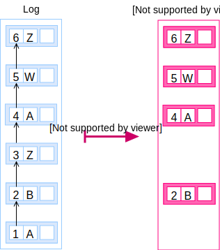
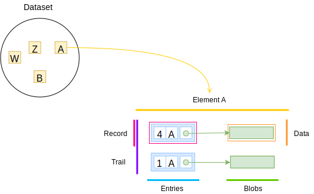

A Register is an unordered dataset of elements of a single type of _thing_
with the ability to provide previous versions for the elements held in it. The
dataset can be mapped to any of the [serialisation
formats](/rest-api#serialisation) defined in this specification and it can be
published over HTTP as a [REST API](/rest-api).

The backbone data structure is the [**log**](/glossary/log) of changes. It is
a sequence of entries identified by their numerical order, the [entry
number](/glossary/entry#number).

Each [entry](/glossary/entry) defines a change for an element in the dataset
by recording the time the change was appended to the log, the numerical order
in the log, the key to identify the element the change is for and the
reference to the [data for that element](/glossary/item).

A [snapshot](/glossary/snapshot) of the state of the Register can be collected
from the log. When the snapshot is the latest one, the elements are called
[records](/glossary/record).

A Register uses a sidecar data structure derived from the **log** that allows
anyone to efficiently audit the integrity of the data held in it. This data
structure is a [Merkle tree](https://en.wikipedia.org/wiki/Merkle_tree) as
described by the Certificate Transparency [RFC6962](@rfc6962). Check the
[Audit section](/data-model/audit) for details.

In summary, the **log** and all its parts form an immutable data structure that
allow expressing a sequence of changes on the dataset of elements, the
Register.

