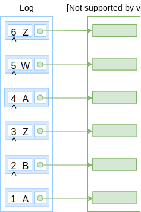

A Register is an unordered dataset of elements of a single type of _thing_
with the ability to provide previous versions for the elements held in it. The
dataset can be mapped to any of the [serialisation
formats](/rest-api#serialisation) defined in this specification and it can be
published over HTTP as a [REST API](/rest-api).

The backbone data structure is the **log** of changes.

The [log](/glossary/log) of changes is a sequence of entries identified by
their numerical order, the [entry number](/glossary/entry#number).

Each [entry](/glossary/entry) defines a change for an element in the dataset
by recording the time the change was appended to the log, the numerical order
in the log, the key to identify the element the change is for and the
reference to the [data for that element](/glossary/item).

The result of applying a change to the dataset is a new
[snapshot](/glossary/snapshot) and, when the snapshot is the latest one, the
elements are called [records](/glossary/record).

In summary, the **log** and all its parts form an immutable data structure that
allow expressing a sequence of changes on the dataset of elements, the
Register.

## Anatomy of an element

## Schema evolution

***
ISSUE: Define how schema evolution works.
***

[Schema](/glossary/schema) evolution depends on two pillars: backwards
compatibility and forwards compatibility.

**Backwards compitability** requires that once a [data
attribute](/glossary/attribute) is introduced its semantics don't change.

**Forwards compatibility** requires that tools consuming a register MUST apply the
“must-ignore” rule for unknown attributes and assume that a missing known
attribute is a missing value.

Check the [Evolve section](/data-model/evolve) for details.

## Auditing

A Register uses a sidecar data structure derived from the **log** that allows
anyone to efficiently audit the integrity of the data held in it. This data
structure is a [Merkle tree](https://en.wikipedia.org/wiki/Merkle_tree) as
described by the Certificate Transparency [RFC6962](@rfc6962). Check the
[Audit section](/data-model/audit) for details.
