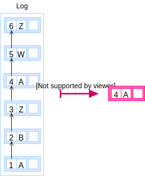
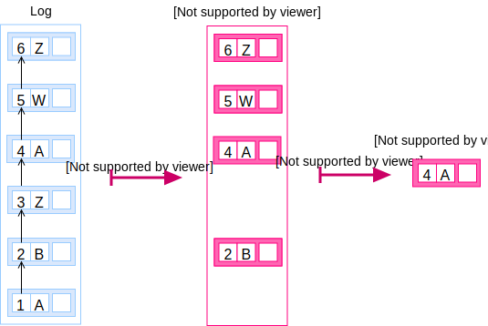

A **record** is an [entry](/glossary/entry), element of the latest
[snapshot](/glossary#snapshot). It can be computed from the
[log](/glossary#log) by a similar method of computing a snapshot.

```elm
record : ID -> Log -> Maybe Entry
```

The algorithm:

1. Let _key_ be the identifier for the record to find.
1. Let _log_ be the full log to parse.
1. Let _result_ be null.
1. Foreach _entry_ in _log_:
    1. If the _entry_ key equals _key_, set __entry__ to  _result_.

       Otherwise, do nothing.

After all entries in the log have been inspected, the latest one stored in
_result_ is the record. If no entries were found for _key_, the record doesn't
exist in the Register.



A record MAY also be obtained from the [snaphot](/glossary/snapshot):

```elm
record : ID -> Snapshot -> Maybe Entry
```



Similarly, you can filter the [log](/glossary/log) to get the
[trail](/glossary/trail) of changes for an element and from the trail, get the
record:

```elm
sieve : ID -> Log -> Trail
record : Trail -> Entry
```


